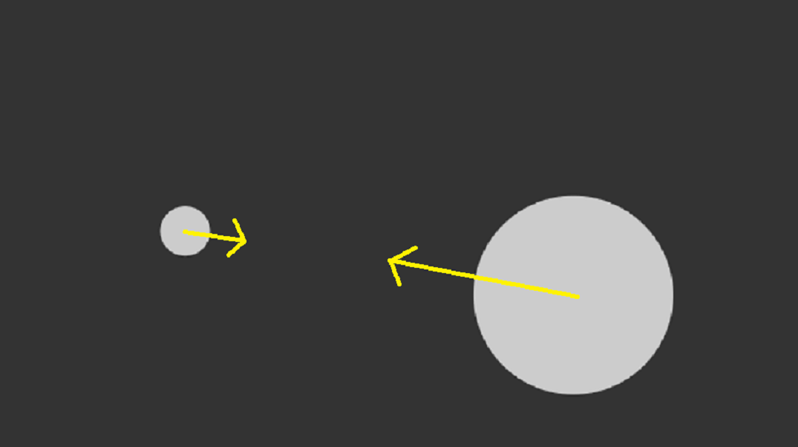
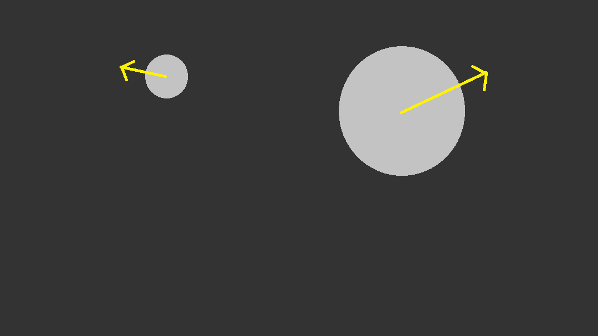

# 제목

#### **부제목**

</br>

##### 20423이정민

---

# ✨ Project Information

### | **준비 기간**

  </br>

###### 2주

</br>

### | **분야**

  </br>

###### `정보분야`


---



---



---
# 📝 프로젝트 내용

### | 주제

두 원이 충돌할 때, 먼저 원 사이 최소 거리를 비교함. 만약 거리가 최소 거리보다 작다면, 두원이 충돌한 것으로 판단. 이후 삼각함수를 이용해 충돌 이후의 속도와 위치 계산

---

# 📝 fps란?

### | 설명

FPS는 "프레임 속도"라는 뜻으로, 초당 화면에 표시되는 프레임 수를 의미함 일반적으로 FPS는 높을수록 화면이 부드럽게 보임.

---

# 📝 연관성

### | 설명

아래의 코드는 원과 충돌 감지를 구현하는 코드

---

# 

### | 설명

원을 나타내는 두 개의 공이 서로 충돌을 감지하고, 충돌 시 속도를 교환, 이 코드에서는 각 공의 위치와 속도를 업데이트 충돌을 확인하는 코드가 존재

---

#

### | 설명

두 원이 맞닿아 있을때 두 원의 중점 사이의 거리를 최소라고 할 때, 최소 거리 보다 작을때에 충돌이 발생하고 속도를 교환

---

#

### | 설명

실제로 이 코드를 실행하면 두 개의 공이 서로 충돌하면서 화면에 튕기는 모습을 볼 수 있고 이 과정에서 초당 몇번 화면이 업데이트 되는지에 따라서 fps가 결정됨

---

## 💡 참조 code

- #### Circle Collision

```Java
Ball[] balls =  { 
  new Ball(100, 400, 20), 
  new Ball(700, 400, 80) 
};

void setup() {
  size(640, 360);
}
```

---

```Java
void draw() {
  background(51);

  for (Ball b : balls) {
    b.update();
    b.display();
    b.checkBoundaryCollision();
  }
  
  balls[0].checkCollision(balls[1]);
}

```

---

## 💡 참조 code

- #### balls

```Java
class Ball {
  PVector position;
  PVector velocity;

  float radius, m;

  Ball(float x, float y, float r_) {
    position = new PVector(x, y);
    velocity = PVector.random2D();
    velocity.mult(3);
    radius = r_;
    m = radius*.1;
  }
```

---

```Java
void update() {
    position.add(velocity);
  }

  void checkBoundaryCollision() {
    if (position.x > width-radius) {
      position.x = width-radius;
      velocity.x *= -1;
    } else if (position.x < radius) {
      position.x = radius;
      velocity.x *= -1;
    } else if (position.y > height-radius) {
      position.y = height-radius;
      velocity.y *= -1;
    } else if (position.y < radius) {
      position.y = radius;
      velocity.y *= -1;
    }
  }


```

---

```Java
void checkCollision(Ball other) {

    // Get distances between the balls components
    PVector distanceVect = PVector.sub(other.position, position);

    // Calculate magnitude of the vector separating the balls
    float distanceVectMag = distanceVect.mag();

    // Minimum distance before they are touching
    float minDistance = radius + other.radius;
```

---

```Java
    if (distanceVectMag < minDistance) {
      float distanceCorrection = (minDistance-distanceVectMag)/2.0;
      PVector d = distanceVect.copy();
      PVector correctionVector = d.normalize().mult(distanceCorrection);
      other.position.add(correctionVector);
      position.sub(correctionVector);

      // get angle of distanceVect
      float theta  = distanceVect.heading();
      // precalculate trig values
      float sine = sin(theta);
      float cosine = cos(theta);

      /* bTemp will hold rotated ball positions. You 
       just need to worry about bTemp[1] position*/
      PVector[] bTemp = {
        new PVector(), new PVector()
      };
```

---

```Java
    if (distanceVectMag < minDistance) {
      float distanceCorrection = (minDistance-distanceVectMag)/2.0;
      PVector d = distanceVect.copy();
      PVector correctionVector = d.normalize().mult(distanceCorrection);
      other.position.add(correctionVector);
      position.sub(correctionVector);

      // get angle of distanceVect
      float theta  = distanceVect.heading();
      // precalculate trig values
      float sine = sin(theta);
      float cosine = cos(theta);

      /* bTemp will hold rotated ball positions. You 
       just need to worry about bTemp[1] position*/
      PVector[] bTemp = {
        new PVector(), new PVector()
      };
```

---

```Java
      /* this ball's position is relative to the other
       so you can use the vector between them (bVect) as the 
       reference point in the rotation expressions.
       bTemp[0].position.x and bTemp[0].position.y will initialize
       automatically to 0.0, which is what you want
       since b[1] will rotate around b[0] */
      bTemp[1].x  = cosine * distanceVect.x + sine * distanceVect.y;
      bTemp[1].y  = cosine * distanceVect.y - sine * distanceVect.x;

      // rotate Temporary velocities
      PVector[] vTemp = {
        new PVector(), new PVector()
      };
```

---

```Java
      /* this ball's position is relative to the other
       so you can use the vector between them (bVect) as the 
       reference point in the rotation expressions.
       bTemp[0].position.x and bTemp[0].position.y will initialize
       automatically to 0.0, which is what you want
       since b[1] will rotate around b[0] */
      bTemp[1].x  = cosine * distanceVect.x + sine * distanceVect.y;
      bTemp[1].y  = cosine * distanceVect.y - sine * distanceVect.x;

      // rotate Temporary velocities
      PVector[] vTemp = {
        new PVector(), new PVector()
      };
```

---

```Java
      vTemp[0].x  = cosine * velocity.x + sine * velocity.y;
      vTemp[0].y  = cosine * velocity.y - sine * velocity.x;
      vTemp[1].x  = cosine * other.velocity.x + sine * other.velocity.y;
      vTemp[1].y  = cosine * other.velocity.y - sine * other.velocity.x;

      /* Now that velocities are rotated, you can use 1D
       conservation of momentum equations to calculate 
       the final velocity along the x-axis. */
      PVector[] vFinal = {  
        new PVector(), new PVector()
      };
```

---

```Java
// final rotated velocity for b[0]
      vFinal[0].x = ((m - other.m) * vTemp[0].x + 2 * other.m * vTemp[1].x) / (m + other.m);
      vFinal[0].y = vTemp[0].y;

      // final rotated velocity for b[0]
      vFinal[1].x = ((other.m - m) * vTemp[1].x + 2 * m * vTemp[0].x) / (m + other.m);
      vFinal[1].y = vTemp[1].y;

      // hack to avoid clumping
      bTemp[0].x += vFinal[0].x;
      bTemp[1].x += vFinal[1].x;
```

---

```Java
// final rotated velocity for b[0]
      vFinal[0].x = ((m - other.m) * vTemp[0].x + 2 * other.m * vTemp[1].x) / (m + other.m);
      vFinal[0].y = vTemp[0].y;

      // final rotated velocity for b[0]
      vFinal[1].x = ((other.m - m) * vTemp[1].x + 2 * m * vTemp[0].x) / (m + other.m);
      vFinal[1].y = vTemp[1].y;

      // hack to avoid clumping
      bTemp[0].x += vFinal[0].x;
      bTemp[1].x += vFinal[1].x;
```

---

```Java
/* Rotate ball positions and velocities back
       Reverse signs in trig expressions to rotate 
       in the opposite direction */
      // rotate balls
      PVector[] bFinal = { 
        new PVector(), new PVector()
      };

      bFinal[0].x = cosine * bTemp[0].x - sine * bTemp[0].y;
      bFinal[0].y = cosine * bTemp[0].y + sine * bTemp[0].x;
      bFinal[1].x = cosine * bTemp[1].x - sine * bTemp[1].y;
      bFinal[1].y = cosine * bTemp[1].y + sine * bTemp[1].x;
```

---

```Java
 // update balls to screen position
      other.position.x = position.x + bFinal[1].x;
      other.position.y = position.y + bFinal[1].y;

      position.add(bFinal[0]);

      // update velocities
      velocity.x = cosine * vFinal[0].x - sine * vFinal[0].y;
      velocity.y = cosine * vFinal[0].y + sine * vFinal[0].x;
      other.velocity.x = cosine * vFinal[1].x - sine * vFinal[1].y;
      other.velocity.y = cosine * vFinal[1].y + sine * vFinal[1].x;
    }
  }
```

---

```Java
  void display() {
    noStroke();
    fill(204);
    ellipse(position.x, position.y, radius*2, radius*2);
  }
}
```

---

## 💡 code

- #### read data

```python

```

---

## ✅ result


